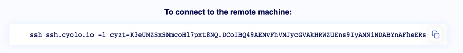

# Using HashiCorp Raft to distribute data between nodes when a database server is not an option

---

# Who are these guys and why can't they use a database server
- We are a Zero Trust Network Access (ZTNA) company
- Our mission is to isolate our customers' private networks and provide network access to it by identifying objects only

---

# Total isolation - the only solution
- Requires no inbound connection to your subnets
- Can operate in air-gapped networks
- Add no latency

  

---

# Problems we face
- Customer may have multiple networks (which means we need multiple connectors)
- Customer may want HA (which means we need multiple connectors per network)
- Customer networks are not always inter-connected (which means we cannot just use a shared database)

---

<!-- _class: lead -->
# Design Patterns

---

# Stateless tokens 
- Requires a shared-secret between the nodes (or even PKI)
- Requires a client-side store (such as cookies or javascript)
- Each node can read/write state securely and easily
 
 

---
  
## "Sticky" transactions
- Requires a method of "calling" a node directly
- Best for managing a resource that is only available on one node
 
--- 
## Raft-based data replication
- Highly consistent, highly available
- Can be used in our network infrastructure
- Allows us to use embedded, disk or in-mem storage

 
 
 
 

---

<!-- _class: lead -->
# Increment the counter

