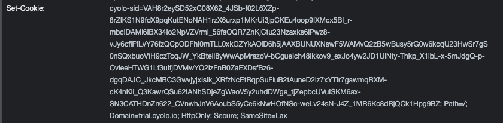
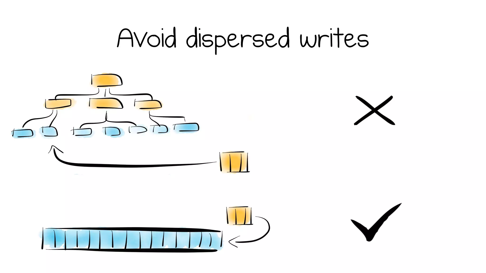

<style>
img[alt~="center"] {
  display: block;
  margin: 0 auto;
}
</style>
# Using HashiCorp Raft to distribute data between nodes when a database server is not an option


---
# Who are these guys and why can't they use a database server
- We are a Zero Trust Network Access (ZTNA) company
- Our mission is to isolate our customers' private networks and provide network access to it by identifying objects only

---
# Total isolation - the only solution
- Requires no inbound connection to your subnets
- Can operate in air-gapped networks
- Add no latency

  

---
# Problems we face
- Customer may have multiple networks (which means we need multiple connectors)
- Customer may want HA (which means we need multiple connectors per network)
- Customer networks are not always inter-connected (which means we cannot just use a shared database)

---
# Session Management
- problem:
  - users need to be authenticated and have their session state needs to be maintained across nodes

- solution:
  - encrypted state tokens allow each node to read and modify the session state securely
  - encryption keys need to be pre-shared among the nodes (we can also leverage PKI)
  - encrypted tokens are stored within the client side (we use cookies) and are tamper-proof

# Session Management - Example
```go
type State struct {
	Value string
}

func Set(w http.ResponseWriter, r *http.Request) {
	s := State{
		Value: "foo",
	}

	b, err := envelope.Seal(system.Keys.Sessions, s)
	if err != nil {
		http.Error(w, err.Error(), http.StatusInternalServerError)
		return
	}

	http.SetCookie(w, &http.Cookie{
		Name:  "cyolo-sid",
		Value: b,
	})
}

func Get(w http.ResponseWriter, r *http.Request) {
	c, err := r.Cookie("cyolo-sid")
	if err != nil {
		http.Error(w, err.Error(), http.StatusForbidden)
		return
	}

	s := State{}

	if err = envelope.Open(system.Keys.Sessions, c.Value, &s); err != nil {
		http.Error(w, err.Error(), http.StatusForbidden)
		return
	}
	
	w.Header().Set("Content-Type", "text/plain")
	_, _ = io.WriteString(w, s.Value) // foo
}
```



---
# Rendezvous Points
- problem:
  - some transactions require interaction between multiple actors
  - examples: MFA links, workflows and things that start in a browser and end in a different client
- solution:
  - sticky routing
  - host identifiers may be used as keys for sticky routing ("app-1.cyolo.io" or "app-2.cyolo.io" vs "app.cyolo.io")

---
## Raft-based data replication
- Highly consistent, highly available
- Can be used in our network infrastructure
- Allows us to use embedded, disk or in-mem storage

<br />
<br />
<br />
<br />


---

<!-- _class: lead -->
# Increment the counter


---
# What is Raft and how does it succeed so well?
- A log data structure is the easiest to replicate
- It leaves it up to you to implement the state machine that applies the transactions it replicates for you



---

<!-- _class: lead -->

# Q&A

---

<!-- _class: lead -->
# Thank you <3
