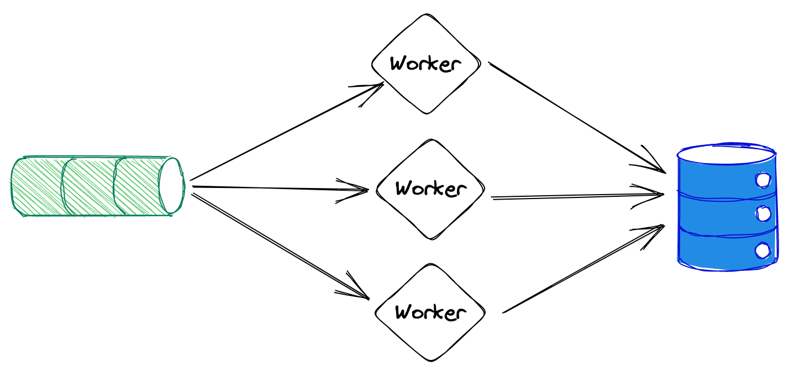

<!-- _class: lead -->
# Hot path optimizations for latency-critical applications in GO

---
## Hot Path (Definition)
Part of the application that runs significantly frequent

&nbsp;

## Why should I care?
- Inefficiency in hot-path will have exponential effect
- Efficiency in hot-path is what determines your scalability

---

## Benchmarking
- Don’t trust your intuition
- GO's benchmark does almost everything for you
- Reporting allocations will help you catch the big fishes


---
<!-- _class: lead -->
### Examples
---
### Interfaces vs. Cast (1)
```go
type Shape interface {
    Area() float64
}

type Rectangle struct {
    W, H float64
}

func (r Rectangle) Area() float64 {
    return r.W * r.H
}
```
---
### Interfaces vs. Cast (2)

```go
func Benchmark_interface(b *testing.B) {
    var shape Shape = Rectangle{4, 2}
    for i := 0; i < b.N; i++ {
        shape.Area()
    }
}
```
```go
func Benchmark_cast(b *testing.B) {
    var shape Shape = Rectangle{4, 2}
    for i := 0; i < b.N; i++ {
        if rec, ok := shape.(Rectangle); ok {
            rec.Area()
        }
    }
}
```
---
<!-- _class: lead -->
### Results
```shell
Benchmark_interface-8    742840539      1.493 ns/op
Benchmark_cast-8         1000000000     0.2912 ns/op
```
---
### Concurrency: Mutex vs. chan (1)

```go
func runConcurrently(concurrency int, fn func()) {
    wg := sync.WaitGroup{}
    for i := 0; i < concurrency; i++ {
        wg.Add(1)
        go func() {
            fn()
            wg.Done()
        }()
    }
    wg.Wait()
}
```
---
### Concurrency: Mutex vs. chan (2)

<div class="grid grid-cols-2 gap-4">
<div>

```go
func Benchmark_Mutex(b *testing.B) {
    var counter int
    var mu sync.Mutex
    for i := 0; i < b.N; i++ {
        runConcurrently(10000, func() {
            mu.Lock()
            counter += 1
            mu.Unlock()
        })
    }
}
```
</div>
<div>

```go
func Benchmark_chan(b *testing.B) {
    var counter int
    ch := make(chan int)
    for i := 0; i < b.N; i++ {
        runConcurrently(10000, func() {
            counter <- 1
        })
    }
}
```
</div>
</div>

---
<!-- _class: lead -->
### Results
```shell
Benchmark_Mutex-8   396	   2956641 ns/op
Benchmark_chan-8    181	   6066474 ns/op
```

---

## The charm of GO's `io` Package
The `Reader` interface makes a good base for stream processing
```go
type Reader interface {
    Read(p []byte) (n int, err error)
}
```

---

### Well known successors:
```go
// bufio.Reader
str = bufio.NewReader(r.Body)
for {
    line, _ := r.ReadBytes('\n')
}
```
```go
// json.Decoder
decoder := json.NewDecoder(r.Body)
for {
    var obj MyStruct
    if err := decoder.Decode(&obj); err != nil { return err }
	else { doSomething(obj) }
}
```

---
## You can use your own buffer
- Allocations are expensive operation that occurs when ref moves up in stack
- Allocations have additional cost in GC cycles
- Using external buffer for read allows re-use of memory and save allocations

---
## Example
```go
type myBufferedReader struct {
    rd     io.Reader
    buf    []byte
    offset int
}
func (r *myBufferedReader) ReadLine() ([]byte, error) {
    n, _ := r.Read(r.buf[r.offset:])
    eol := bytes.IndexByte('\n')
    res := r.buf[:eol]
    r.buf = r.buf[eol+1:]
    
    return res
}
```
---
<!-- _class: lead -->
### Experiment: Count word occurrences in a file
|        |           |
|--------|-----------|
| Size:  | 6M        |
| Lines: | 1,000     |
| Words: | 1,000,000 |

Using `bufio.Scanner` vs my optimized Line reader

---

```go
for i := 0; i < b.N; i++ {
    scanner := bufio.NewScanner(f)
    for scanner.Scan() {
        total += strings.Count(scanner.Text(), word)
    }
}
```

```go
for i := 0; i < b.N; i++ {
    var (err error; buf = make([]byte, 4096))
    for ; err == nil; n, err = f.Read(buf) {
        count = bytes.Count(buf[:n], []byte(word))
        total += count
        buf = buf[:]
    }
}
```

---

## Results
```
bufio.Scanner   226   5250797 ns/op    6537876 B/op     1002 allocs/op
own_buffer      301   3972222 ns/op    0 B/op           0 allocs/op
```
---
<!-- _class: lead -->

## Concurrency bottlenecks and resolutions

---


```go
func add(n int) {
    mu.Lock()
    count += n
    mu.Unlock()
}
```

&nbsp;
&nbsp;
&nbsp;
&nbsp;

```go
func add(n int64) {
    // lock free increment 💪
    atomic.AddInt64(&count, n)
}
```

---

```go
mu.Lock()
defer mu.Unlock()
if _, ok := check(key); ok {
    return
}
do()
set(key)
```
&nbsp;
&nbsp;
&nbsp;

#### Check-Lock-Check pattern --->

---
### Check-Lock-Check
```go
mu.RLock()
_, ok := check(key)
mu.RUnlock()
if ok { return } // early return 💪

mu.Lock()
defer mu.Unlock()
_, ok := check(key)
if ok { return }
do()
set(key)
```
---


```go
res := process(<-ch)
mu.Lock()
update(res)
mu.Unlock()
```
&nbsp;
&nbsp;
&nbsp;
&nbsp;
&nbsp;
&nbsp;
&nbsp;

#### Commit the update in batches --->

---

<div class="grid grid-cols-2 gap-4">
<div>

#### Worker sends to aggregated channel

```go
agg := make(chan *Res)
for {
    agg <- process(<-ch)
}
```

</div>
<div>

#### Worker process results

```go
var batch []*Res
for res := range <-agg:
    batch = append(batch, res)
    batchLoop: for {
        select {
        case res := <-agg:
            batch = append(batch, res)
        default:
            break batchLoop
        }
    }
    mu.Lock()
    update(batch) // batch update 💪
    mu.Unlock()
    batch = batch[:]
}
```

</div>
</div>

---
<!-- _class: lead -->
## The difference between parallelism and concurrency

---

### Concurrency
- The ability of a program or part of it to be executed out-of-order or in partial order, without affecting the outcome.

### Parallelism
- Execution of simultaneous of (possibly related) computations by a program

---

## Common false designs
- Multiple worker routines that take jobs from a channel is not necessarily parallelism
- Using a global mutex because you need to concurrently update the same object creates unpredictable scalability
- Ignoring CPU count misses the point of parallelism and creates an illusion of efficiency



---
<!-- class: lead -->
## Practice  

--- 
<!-- class: -->
### Results worker - split by the work

```go
// processing worker
go func() {
    for {
        results <-process(<-jobs)
    }	
}()
// results worker
go func() {
    for {
        update(<-results)
    }
}()
```
---
### Sharded locks - split by the data
```go
type shard struct {
	mu sync.Mutex
	m  map[string]result
}
func (s *shard) update(r result) {
	s.mu.Lock()
	s.m[r.id] = r
	s.mu.Unlock()
}
for job := range <-jobs {
	res := <-process(job)
	h := hash(res)
	shards[h%4].update(res)
}
```
---
### Execute according to your actual CPUs
```go
for i := 0; i < runtime.NumCPU(); i++ {
	go worker()
}
```
---

## Recap
- Sometimes it is worth it to write lower level and avoid GC overhead
- Eliminate concurrency bottlenecks
- Try to parallelize the work for effective concurrency

---

<!-- class: lead -->
# Q&A

---

<!-- class: lead -->

# Thank You!
# ❤️
